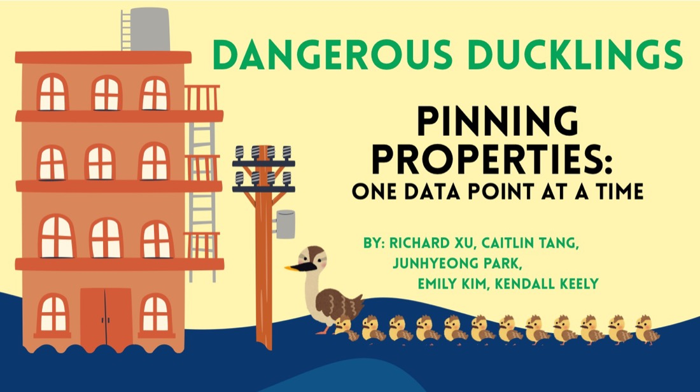
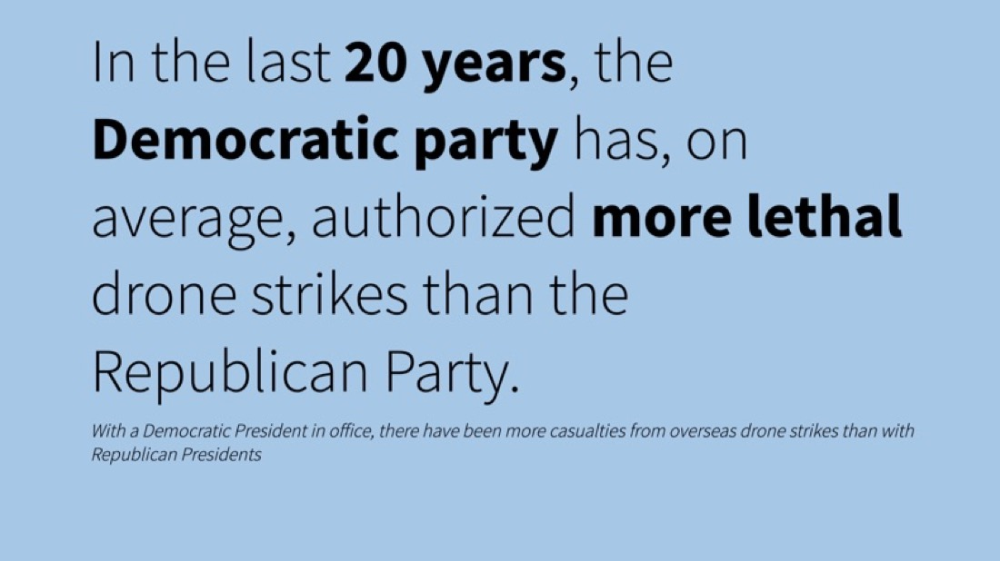

```{=html}
<div class="k-hero">
  <div class="k-hero-inner">
    <div class="k-hero-text">
      <span class="k-eyebrow">Statistics &amp; Data Science · UCLA '26</span>
      <h1>Hi, I'm <span class="gradient-text">Kendall</span>.</h1>
      <p class="k-lede">I turn messy, real-world data into things people can actually decide with <strong>spatial models</strong> of the LA office market, <strong>pricing analysis</strong> across four states, <strong>nonparametric tests</strong> on twenty years of policy data. Mostly in SQL, Python &amp; R, always reproducible.</p>
      <div class="k-buttons">
        <a class="btn-k primary" href="Kendall_Resume_June_2026.pdf">Download résumé</a>
        <a class="btn-k" href="projects.html">See my work</a>
        <a class="btn-k" href="https://www.linkedin.com/in/kendall-keely/">LinkedIn</a>
        <a class="btn-k" href="https://github.com/kendallkeely">GitHub</a>
      </div>
      <div class="k-chips">
        <span class="k-chip">🐶 dog mom</span>
        <span class="k-chip">🌉 San Francisco</span>
        <span class="k-chip">🍜 relentless restaurant explorer</span>
        <span class="k-chip">🀄 mahjong enthusiast</span>
        <span class="k-chip">📈 will defend ggplot2 in public</span>
      </div>
    </div>
    <div class="k-photo-wrap">
      
    </div>
  </div>
</div>

<div class="k-section">
  <div class="k-section-head">
    <h2>Featured work</h2>
    <span class="k-hint">Three projects, three very different problems →</span>
  </div>
  <div class="k-cards">
    <a class="kcard" href="projects.html#datafest">
      <div class="kcard-cover"></div>
      <div class="kcard-body">
        <div class="kcard-kicker">Hackathon · 48 hours</div>
        <h3>Pinning Properties: LA Office Micro-Trends</h3>
        <p>Cleaned and geocoded thousands of Savills commercial lease records to find where post-pandemic office demand actually went. One of 70+ teams.</p>
      </div>
    </a>
    <a class="kcard" href="projects.html#storage-star">
      <div class="kcard-cover gradient"><span>Power Pricing &amp;<br>Rent Dynamics</span></div>
      <div class="kcard-body">
        <div class="kcard-kicker">Internship · Storage Star</div>
        <h3>Rent per Square Foot Across Four Markets</h3>
        <p>Power-model fitting, quarter-over-quarter change detection, and climate-controlled unit comparisons across TX, CO, UT and CA.</p>
      </div>
    </a>
    <a class="kcard" href="projects.html#drone-strikes">
      <div class="kcard-cover"></div>
      <div class="kcard-body">
        <div class="kcard-kicker">Capstone · Stats 140XP</div>
        <h3>Does Party Control Change Drone Strike Lethality?</h3>
        <p>Twenty years of Guardian strike records, tested with Wilcoxon-Mann-Whitney. Lethality differed significantly. Accuracy didn't.</p>
      </div>
    </a>
  </div>
</div>

<div class="k-section">
  <div class="k-section-head">
    <h2>What I work with</h2>
    <span class="k-hint">Tools I reach for first</span>
  </div>
  <div class="k-toolgroup">
    <div class="k-toolgroup-label">Data &amp; analytics</div>
    <div class="k-chips" style="margin-top:0;">
      <span class="k-chip">R</span>
      <span class="k-chip">tidyverse</span>
      <span class="k-chip">ggplot2</span>
      <span class="k-chip">Quarto</span>
      <span class="k-chip">SQL / sqldf</span>
      <span class="k-chip">Python</span>
      <span class="k-chip">Tableau</span>
      <span class="k-chip">Spatial analysis &amp; geocoding</span>
      <span class="k-chip">Nonparametric testing</span>
      <span class="k-chip">Regression &amp; diagnostics</span>
      <span class="k-chip">Reproducible reporting</span>
    </div>
  </div>
  <div class="k-toolgroup">
    <div class="k-toolgroup-label">AI skills</div>
    <div class="k-chips" style="margin-top:0;">
      <span class="k-chip">Cursor</span>
      <span class="k-chip">Claude Code</span>
      <span class="k-chip">Claude</span>
      <span class="k-chip">ChatGPT</span>
      <span class="k-chip">GitHub Copilot</span>
      <span class="k-chip">Notion</span>
      <span class="k-chip">Notion AI</span>
      <span class="k-chip">Isaac</span>
      <span class="k-chip">Perplexity</span>
      <span class="k-chip">Prompt engineering</span>
      <span class="k-chip">AI-assisted analysis</span>
    </div>
  </div>
</div>

<div class="k-footer">
  <div class="k-footer-inner">
    <div>
      <h3>Let's talk data.</h3>
      <p>Open to analytics, strategy, engineering, and BDR roles.</p>
    </div>
    <div class="k-footer-links">
      <a href="mailto:kkeely04@gmail.com">kkeely04@gmail.com</a>
      <a href="https://www.linkedin.com/in/kendall-keely/">LinkedIn</a>
      <a href="https://github.com/kendallkeely">GitHub</a>
      <a href="Kendall_Resume_June_2026.pdf">Résumé</a>
    </div>
  </div>
</div>
```
