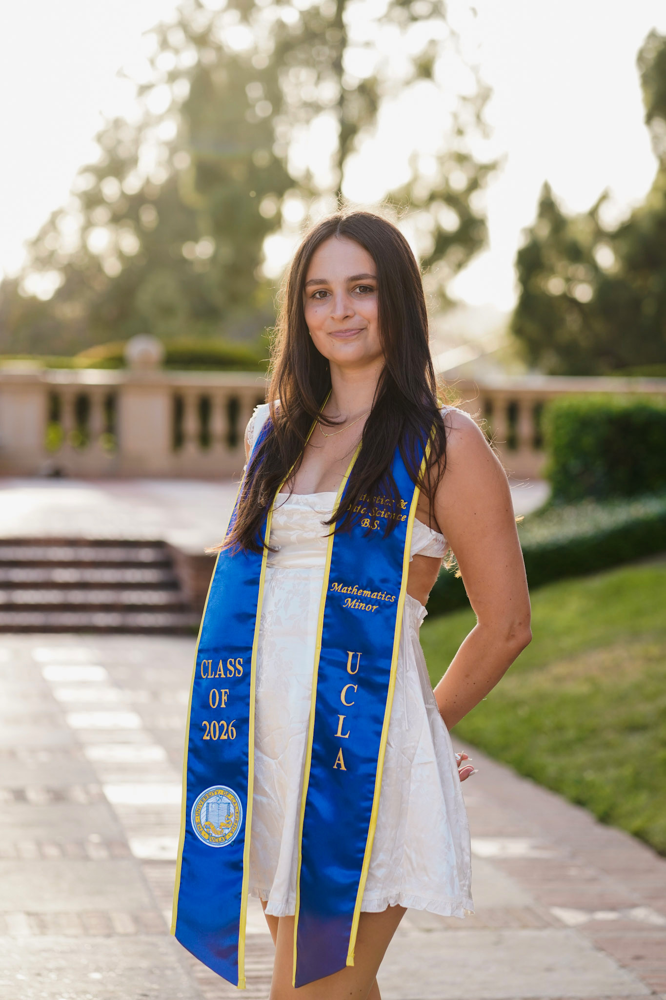

# Hello, I'm Kendall!

I’m a recent graduate from the University of California, Los Angeles, where I earned a degree in Statistics & Data Science with a Mathematics minor. I am originally from the Bay Area, where I grew up surrounded by tech, numbers, and a love for problem solving, all of which eventually led me to pursue data.

At UCLA, I split my time between classes, research projects, and campus involvement. Outside of academics,I loved going to the beach, exploring new restaurants, or playing with my two dogs. 

[⭐ Download My Resume](Kendall_Resume_June_2026.pdf){.hero-button}
[⭐ ️Connect on LinkedIn](https://www.linkedin.com/in/kendall-keely/){.hero-button}
[⭐ Git Hub](https://github.com/kendallkeely){.hero-button}

