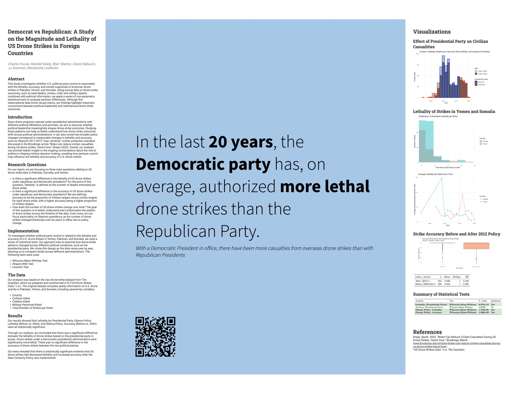

```{=html}
<div class="k-section" style="margin-top:2.5rem;">
  <div class="k-section-head">
    <h2>Projects</h2>
    <span class="k-hint">A hackathon, an internship, and a capstone</span>
  </div>
  <p class="k-lede">Three projects that pushed me in different directions — speed and collaboration under a 48-hour clock, business decision support with real money attached, and careful statistical inference on messy public data.</p>
</div>

<div class="k-section">

  <div class="k-project" id="datafest">
    <div class="k-project-cover">
      
    </div>
    <h2>Pinning Properties: LA Office Micro-Trends</h2>
    <div class="k-meta">
      <span class="k-tag role">Team member · DataFest 2025</span>
      <span class="k-tag">R</span>
      <span class="k-tag">Python</span>
      <span class="k-tag">tidyverse</span>
      <span class="k-tag">ggplot2</span>
      <span class="k-tag">sqldf</span>
      <span class="k-tag">Geocoding</span>
      <span class="k-tag">Spatial viz</span>
    </div>
    <p>UCLA's DataFest gives you a commercial dataset and 48 hours. Ours came from <strong>Savills</strong>: a large national record of U.S. office leasing. My team — the Dangerous Ducklings — set out to find where office demand actually went after the pandemic, rather than just confirming that it fell.</p>
    <p>We narrowed to Los Angeles County so we could say something specific instead of something vague. That meant cleaning and merging thousands of lease records, geocoding building addresses, and mapping how A-class and O-class buildings diverged block by block.</p>
    <ul>
      <li>Cleaned and merged high-volume leasing records across inconsistent address formats</li>
      <li>Geocoded buildings and mapped leasing activity spatially</li>
      <li>Built a scoring system to rank micro-markets by demand shift</li>
      <li>Delivered a presentation judged against 70+ competing teams</li>
    </ul>
    <div class="k-takeaway">
      <strong>What I took from it:</strong> scope discipline. The teams that tried to cover the whole country had nothing concrete to show at hour 48. Narrowing to one county was what made our findings legible.
    </div>
    <div class="k-project-links">
      <a class="btn-k primary" href="DataFest_Pres.pdf">View the slides</a>
    </div>
  </div>

  <div class="k-project" id="storage-star">
    <h2>Power Pricing &amp; Yearly Rent Dynamics</h2>
    <div class="k-meta">
      <span class="k-tag role">Data Science Intern · Storage Star</span>
      <span class="k-tag">SQL</span>
      <span class="k-tag">R</span>
      <span class="k-tag">tidyverse</span>
      <span class="k-tag">Power models</span>
      <span class="k-tag">Diagnostics</span>
      <span class="k-tag">Quarto</span>
    </div>
    <p>During my summer internship at Storage Star, a self-storage operator, I built a multi-part analytics report on <strong>rent per square foot</strong> across their Texas, Colorado, Utah, and California markets. The question behind it was practical: where is pricing drifting, and is that drift real or noise?</p>
    <ul>
      <li>Quarter-over-quarter change detection across markets</li>
      <li>Power model fitting, with residual and diagnostic checks</li>
      <li>Climate-controlled vs. non-climate-controlled unit comparisons</li>
      <li>Outlier identification and sensitivity analysis to test how fragile each conclusion was</li>
      <li>Reproducible visualizations and reporting built in R and Quarto</li>
    </ul>
    <div class="k-takeaway">
      <strong>What I took from it:</strong> a model is only useful if someone can act on it. The sensitivity analysis mattered more to the people reading my report than the fitted coefficients did.
    </div>
    <p class="k-note">The deliverable contains Storage Star's proprietary pricing data, so it isn't published here. Happy to walk through the methodology and findings in conversation.</p>
  </div>

  <div class="k-project" id="drone-strikes">
    <div class="k-project-cover">
      
    </div>
    <h2>Does Party Control Change Drone Strike Lethality?</h2>
    <div class="k-meta">
      <span class="k-tag role">Statistical Analyst · Stats 140XP Capstone</span>
      <span class="k-tag">R</span>
      <span class="k-tag">Wilcoxon-Mann-Whitney</span>
      <span class="k-tag">Shapiro-Wilk</span>
      <span class="k-tag">Levene's test</span>
    </div>
    <p>For our capstone, my group asked whether U.S. political party control is associated with the <strong>lethality, accuracy, and magnitude</strong> of drone strikes in Pakistan, Yemen, and Somalia — using two decades of records compiled by The Guardian.</p>
    <p>The data was annual, non-normal, and unbalanced across administrations, so parametric tests were off the table. We built a cleaned yearly dataset, derived comparable metrics, and used nonparametric methods throughout.</p>
    <ul>
      <li>Transformed The Guardian's raw strike records into a clean annual dataset</li>
      <li>Derived comparable metrics including median people killed and accuracy ratios</li>
      <li>Tested partisan differences with Wilcoxon-Mann-Whitney, validating assumptions with Shapiro-Wilk and Levene's</li>
      <li>Examined whether the 2012 "Near Certainty" policy changed outcomes</li>
    </ul>
    <div class="k-takeaway">
      <strong>Findings:</strong> lethality was significantly higher under Democratic presidents, while accuracy showed no significant difference. Strikes after the 2012 policy were significantly less lethal and more accurate. Because the data is observational, we framed all of this as association rather than cause.
    </div>
    <div class="k-project-links">
      <a class="btn-k primary" href="140poster.pdf">View the poster</a>
      <a class="btn-k" href="Stats140_Report.pdf">Read the full report</a>
    </div>
  </div>

</div>

<div class="k-footer">
  <div class="k-footer-inner">
    <div>
      <h3>Let's talk data.</h3>
      <p>Open to analytics, strategy, engineering, and BDR roles.</p>
    </div>
    <div class="k-footer-links">
      <a href="mailto:kkeely04@gmail.com">kkeely04@gmail.com</a>
      <a href="https://www.linkedin.com/in/kendall-keely/">LinkedIn</a>
      <a href="https://github.com/kendallkeely">GitHub</a>
      <a href="Kendall_Resume_June_2026.pdf">Résumé</a>
    </div>
  </div>
</div>
```
